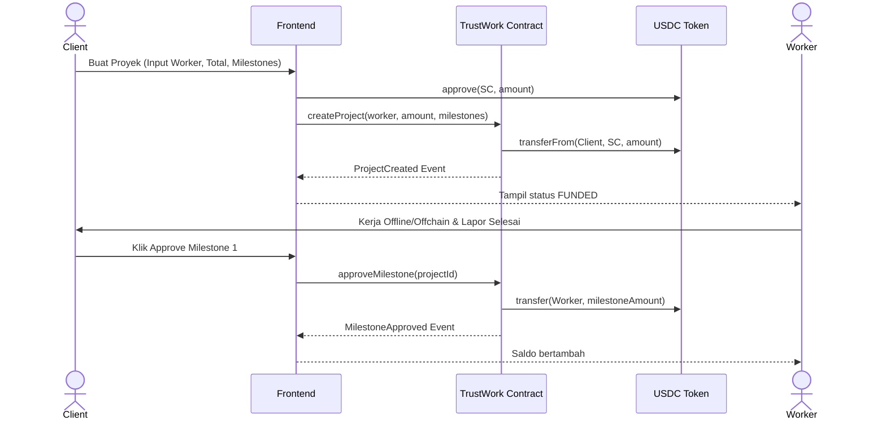
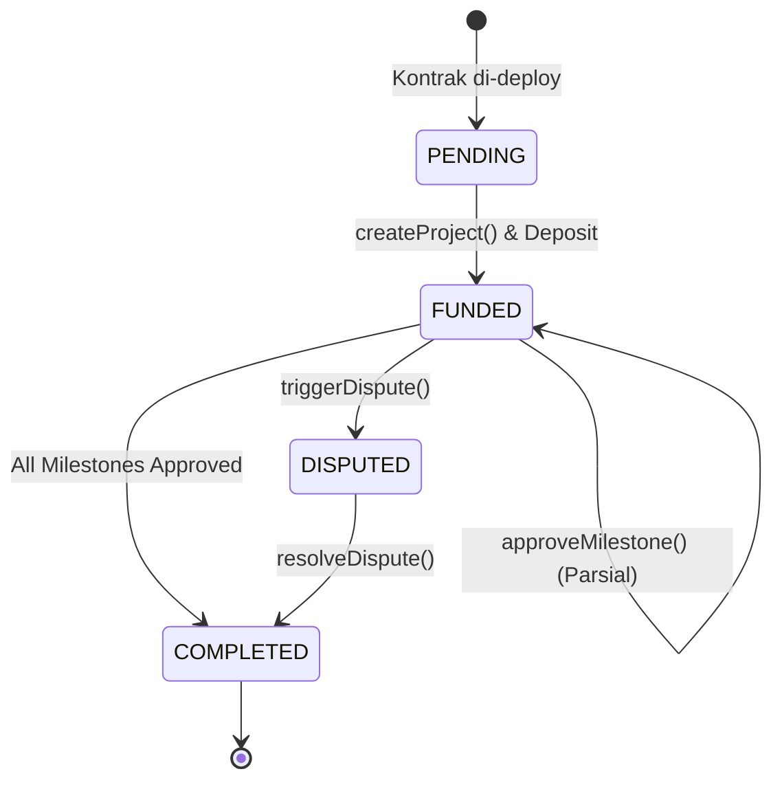

# UML & BPMN (Mermaid)

## 1. Sequence Diagram

```mermaid
sequenceDiagram
    actor Client
    participant UI as Frontend
    participant SC as TrustWork Contract
    participant Token as USDC Token
    actor Worker

    Client->>UI: Buat Proyek (Input Worker, Total, Milestones)
    UI->>Token: approve(SC, amount)
    UI->>SC: createProject(worker, amount, milestones)
    SC->>Token: transferFrom(Client, SC, amount)
    SC-->>UI: ProjectCreated Event
    UI-->>Worker: Tampil status FUNDED
    
    Worker->>Client: Kerja Offline/Offchain & Lapor Selesai
    
    Client->>UI: Klik Approve Milestone 1
    UI->>SC: approveMilestone(projectId)
    SC->>Token: transfer(Worker, milestoneAmount)
    SC-->>UI: MilestoneApproved Event
    UI-->>Worker: Saldo bertambah
```

## 2. State Diagram (Smart Contract Lifecycle)

```mermaid
stateDiagram-v2
    [*] --> PENDING : Kontrak di-deploy
    PENDING --> FUNDED : createProject() & Deposit
    FUNDED --> FUNDED : approveMilestone() (Parsial)
    FUNDED --> DISPUTED : triggerDispute()
    FUNDED --> COMPLETED : All Milestones Approved
    DISPUTED --> COMPLETED : resolveDispute()
    COMPLETED --> [*]
```
